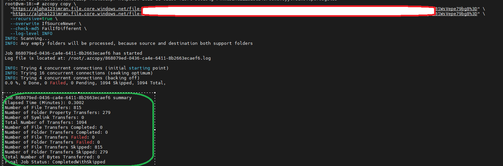

# Azure Storage File Share Troubleshooting

## Problem

While accessing Azure File Share, multiple errors were encountered:

### 1. Using `azcopy list`
```bash
azcopy list "https://<STORAGE_ACCOUNT_NAME>.file.core.windows.net/<SOURCE_SHARE>?<SAS_TOKEN>"
````

**Error**

```
failed to traverse container: GET https://<STORAGE_ACCOUNT_NAME>.file.core.windows.net/<SOURCE_SHARE>/
--------------------------------------------------------------------------------
RESPONSE 403: 403 This request is not authorized to perform this operation.
ERROR CODE: AuthorizationFailure
--------------------------------------------------------------------------------
<?xml version="1.0" encoding="utf-8"?>
<Error>
  <Code>AuthorizationFailure</Code>
  <Message>This request is not authorized to perform this operation.
  RequestId:<REQUEST_ID>
  Time:<ERROR_TIMESTAMP></Message>
</Error>
--------------------------------------------------------------------------------
```

---

### 2. Using `az storage file list` with account key

```bash
az storage file list \
  --account-name <STORAGE_ACCOUNT_NAME> \
  --account-key "<ACCOUNT_KEY>" \
  --share-name <SOURCE_SHARE>
```

**Error**

```
The request may be blocked by network rules of storage account. 
Please check network rule set using 'az storage account show -n accountname --query networkRuleSet'.
If you want to change the default action to apply when no rule matches, please use 'az storage account update'.
```

---

### 3. Using `az storage file list` with Managed Identity

```bash
az login --identity
az storage file list \
  --account-name <STORAGE_ACCOUNT_NAME> \
  --share-name <SOURCE_SHARE> \
  --auth-mode login \
  --enable-file-backup-request-intent
```

**Error**

```
You do not have the required permissions needed to perform this operation.
Depending on your operation, you may need to be assigned one of the following roles:
    "Storage Blob Data Owner"
    "Storage Blob Data Contributor"
    "Storage Blob Data Reader"
    "Storage Queue Data Contributor"
    "Storage Queue Data Reader"
    "Storage Table Data Contributor"
    "Storage Table Data Reader"
```

---

## ✅ Solution (Step-by-Step)

### 1. Check current Storage Account network rules

```bash
az storage account show \
  -n <STORAGE_ACCOUNT_NAME> \
  --query networkRuleSet
```

**Expected Output**

```json
{
  "bypass": "AzureServices",
  "defaultAction": "Deny",
  "ipRules": [],
  "virtualNetworkRules": []
}
```

---

### 2. Get VM's subnet information

```bash
az vm show \
  --resource-group <RESOURCE_GROUP> \
  --name <VM_NAME> \
  --query "networkProfile.networkInterfaces[].id" -o tsv
```

**Expected Output**

```
/subscriptions/<SUBSCRIPTION_ID>/resourceGroups/<RESOURCE_GROUP>/providers/Microsoft.Network/networkInterfaces/<NIC_NAME>
```

---

### 3. Get the subnet ID from the NIC

```bash
az network nic show \
  --ids <NIC_ID> \
  --query "ipConfigurations[].subnet.id" -o tsv
```

**Expected Output**

```
/subscriptions/<SUBSCRIPTION_ID>/resourceGroups/<RESOURCE_GROUP>/providers/Microsoft.Network/virtualNetworks/<VNET_NAME>/subnets/<SUBNET_NAME>
```

---

### 4. Verify service endpoints for Microsoft.Storage

```bash
az network vnet subnet show \
  --ids <SUBNET_ID> \
  --query "serviceEndpoints"
```

**Expected Output**

```json
[
  {
    "locations": ["centralindia"],
    "service": "Microsoft.Storage",
    "provisioningState": "Succeeded"
  }
]
```

---

### 5. Log in using Managed Identity

```bash
az login --identity
```

**Expected Output**

```json
[
  {
    "environmentName": "AzureCloud",
    "id": "<SUBSCRIPTION_ID>",
    "tenantId": "<TENANT_ID>",
    "user": {
      "name": "systemAssignedIdentity",
      "type": "servicePrincipal"
    }
  }
]
```

---

### 6. Assign proper role to Managed Identity

```bash
az role assignment create \
  --assignee-object-id <MSI_OBJECT_ID> \
  --assignee-principal-type ServicePrincipal \
  --role "Storage File Data SMB Share Contributor" \
  --scope $(az storage account show -n <STORAGE_ACCOUNT_NAME> --query id -o tsv)
```

**Expected Output**

```json
{
  "principalId": "<MSI_OBJECT_ID>",
  "roleDefinitionName": "Storage File Data SMB Share Contributor",
  "scope": "/subscriptions/<SUBSCRIPTION_ID>/resourceGroups/<RESOURCE_GROUP>/providers/Microsoft.Storage/storageAccounts/<STORAGE_ACCOUNT_NAME>"
}
```

---

### 7. Add your current public IP to network rules

```bash
MYIP=$(curl -s ifconfig.me)
az storage account network-rule add \
  --resource-group <RESOURCE_GROUP> \
  --account-name <STORAGE_ACCOUNT_NAME> \
  --ip-address $MYIP
```

**Expected Output**

```json
{
  "networkRuleSet": {
    "defaultAction": "Deny",
    "ipRules": [
      { "action": "Allow", "ipAddressOrRange": "<YOUR_PUBLIC_IP>" }
    ]
  }
}
```

---

### 8. Generate a SAS token for AzCopy

```bash
az storage account generate-sas \
  --permissions acdlrw \
  --account-name <STORAGE_ACCOUNT_NAME> \
  --services f \
  --resource-types sco \
  --expiry 2025-12-31T23:59:00Z \
  --https-only
```

**Expected Output**

```
"se=2025-12-31T23%3A59%3A00Z&sp=rwdlac&spr=https&sv=2022-11-02&ss=f&srt=sco&sig=<SIGNATURE>"
```

---

### 9. Copy data between file shares with AzCopy

```bash
azcopy copy \
  "https://<STORAGE_ACCOUNT_NAME>.file.core.windows.net/<SOURCE_SHARE>?<SAS_TOKEN>" \
  "https://<STORAGE_ACCOUNT_NAME>.file.core.windows.net/<DESTINATION_SHARE>?<SAS_TOKEN>" \
  --recursive=true \
  --overwrite IfSourceNewer \
  --check-md5 FailIfDifferent \
  --log-level INFO
```

**Expected Output**

```
Job <JOB_ID> summary
Elapsed Time (Minutes): 0.30
Number of File Transfers: XXX
Number of File Transfers Completed: XXX
Final Job Status: Completed
```

---

### ✅ Final Output After Copying Files

After running the `azcopy copy` command, you should see a summary similar to this:



---

### 🔎 Common Error Codes
* AuthorizationFailure
Cause: No valid RBAC role or SAS permissions.
Fix: Assign the correct role or generate SAS with required permissions.

* AuthenticationFailed
Cause: Invalid SAS token (signature mismatch or expired).
Fix: Re-generate SAS with correct permissions and expiry.

* NetworkRuleBlocked
Cause: Storage Account network rules deny your IP or subnet.
Fix: Add your public IP or subnet to allowed list.

---
## 🔎 Summary

The issue occurred due to two main reasons:

1. **Network Restrictions**:
   The Storage Account had `defaultAction: Deny` with no valid IP rules, causing access blocks even with valid keys.

2. **Insufficient Permissions for Managed Identity**:
   The system-assigned Managed Identity lacked the **Storage File Data SMB Share Contributor** role.

### Fix Implemented

* Verified subnet service endpoints for Microsoft.Storage.
* Added Managed Identity role assignment.
* Allowed the VM’s current public IP in Storage Account network rules.
* Used a SAS token with required permissions for AzCopy.

This combination successfully resolved both the **AuthorizationFailure** and **Network Rule Deny** errors, enabling data copy between file shares.

```

---
```
